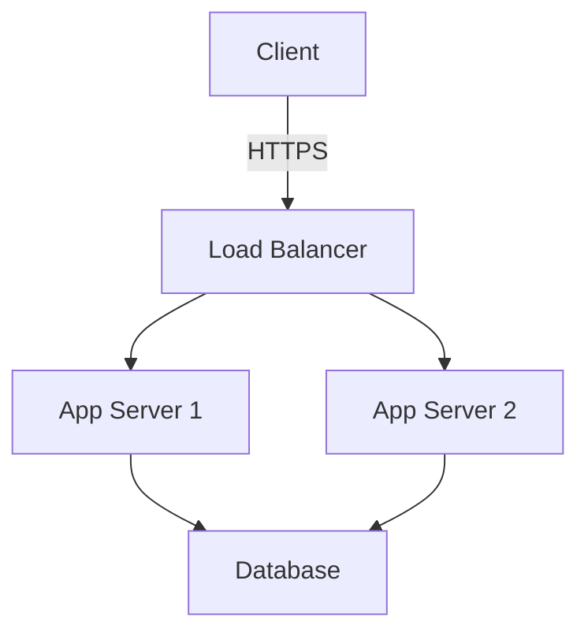

# Instructions for Technical Documentation Enhancement

## Objective

Create comprehensive, detailed, and visually engaging technical documentation for fullstack developers, covering DevOps, security, design, AI, and other technical topics.

## Core Principles

### 1. Clarity and Technical Depth

- **Start with context**: Explain the "why" before the "how"
- **Logical progression**: From general concept to implementation details
- **Concrete examples**: Always illustrate with real, functional code
- **Use cases**: Present practical application scenarios

### 2. Content Structure

Each documentation page should follow this structure:

```markdown
---
title: "Descriptive Title"
description: "Concise description (150-160 characters)"
order: 1
navigation: true
---

# Main Title

## Overview

Context and subject introduction (2-3 paragraphs)

## Prerequisites

- Required knowledge
- Required tools
- Recommended versions

## Core Concepts

### Sub-concept 1

Detailed explanation with diagrams if necessary

## Practical Implementation

### Basic Example

\`\`\`typescript
// Commented and explained code
\`\`\`

### Advanced Use Cases

\`\`\`typescript
// More complex examples
\`\`\`

## Best Practices

::callout{icon="i-heroicons-check-circle" color="green"}
#summary
Best Practices

#content

- ✅ Do this
- ✅ Recommendations
  ::

## Common Pitfalls

::callout{icon="i-heroicons-exclamation-triangle" color="red"}
#summary
Common Pitfalls

#content

- ❌ Avoid this
- ⚠️ Points of attention
  ::

## Performance and Optimization

Metrics, benchmarks, and optimizations

## Security

Specific security considerations

## Additional Resources

- Official documentation
- Reference articles
- Explanatory videos
```

## MDC Components to Use

### Callouts (Alerts)

```markdown
::callout{icon="i-heroicons-information-circle"}
💡 **Info**: Useful information
::

::callout{icon="i-heroicons-check-circle" color="green"}
✅ **Success**: Best practice or positive outcome
::

::callout{icon="i-heroicons-exclamation-triangle" color="amber"}
⚠️ **Warning**: Important point to note
::

::callout{icon="i-heroicons-exclamation-circle" color="red"}
🚨 **Danger**: Critical error or security risk
::
```

### Callouts with Summary and Content

```markdown
::callout{icon="i-heroicons-light-bulb" color="blue"}
#summary
Important Tip

#content
Use this pattern when you need a longer explanation with multiple paragraphs or lists.
::
```

### Enhanced Code Blocks

Use the `filename` attribute for code blocks:

```markdown
\`\`\`typescript [server/api/users.ts]
// TypeScript code with filename
export default defineEventHandler(async (event) => {
const users = await getUsers()
return users
})
\`\`\`
```

Code groups with tabs:

```markdown
::code-group
\`\`\`typescript [server/api/users.ts]
// TypeScript code
const example: string = 'Hello'
\`\`\`

\`\`\`javascript [server/api/users.js]
// JavaScript code
const example = 'Hello'
\`\`\`

\`\`\`python [api/users.py]

# Python code

example = 'Hello'
\`\`\`
::
```

### Code Highlighting

Highlight specific lines:

```markdown
\`\`\`typescript [nuxt.config.ts] {2-4}
export default defineNuxtConfig({
modules: [
'@nuxt/content'
]
})
\`\`\`
```

### Navigation Cards

```markdown
::card-group
::card

---

title: DevOps Guide
icon: i-heroicons-server
to: /devops/introduction

---

Discover DevOps practices
::

::card

---

title: Security
icon: i-heroicons-shield-check
to: /security/basics

---

Secure your applications
::
::
```

### Tabs for Multiple Examples

```markdown
::tabs
::div{label="Frontend"}
Frontend code example

\`\`\`vue [components/Button.vue]
<template>
<button>Click me</button>
</template>
\`\`\`
::

::div{label="Backend"}
Backend code example

\`\`\`typescript [server/api/handler.ts]
export default defineEventHandler(() => {
return { message: 'Hello' }
})
\`\`\`
::

::div{label="Database"}
SQL or NoSQL query

\`\`\`sql [query.sql]
SELECT \* FROM users WHERE active = true;
\`\`\`
::
::
```

## Enhancement by Domain

### DevOps

- **Architecture diagrams**: Use Mermaid for schemas
- **CI/CD pipelines**: Show complete configurations (GitHub Actions, GitLab CI, Jenkins)
- **Infrastructure as Code**: Terraform, Ansible, Kubernetes manifests examples
- **Monitoring**: Metrics, dashboards, alerts
- **Shell commands**: Always with line-by-line explanations

```markdown
::code-group
\`\`\`yaml [.github/workflows/ci.yml]
name: CI/CD Pipeline
on: [push]
jobs:
build:
runs-on: ubuntu-latest
steps: - uses: actions/checkout@v3 - name: Build
run: npm run build
\`\`\`

\`\`\`yaml [.gitlab-ci.yml]
build:
script: - npm run build
only: - main
\`\`\`
::
```

### Security

- **Vulnerabilities**: OWASP Top 10, CVE
- **Attack examples**: Vulnerable code vs secure code
- **Authentication/Authorization**: JWT, OAuth, RBAC
- **Encryption**: Algorithms, implementations
- **Security headers**: CSP, CORS, HSTS

```markdown
::callout{icon="i-heroicons-exclamation-circle" color="red"}
#summary
🚨 SQL Injection Vulnerability

#content
Never concatenate user input directly into SQL queries.
::

**Vulnerable code**:
\`\`\`javascript [bad-example.js]
// ❌ NEVER DO THIS
const query = `SELECT * FROM users WHERE id = ${userId}`
\`\`\`

**Secure code**:
\`\`\`javascript [good-example.js]
// ✅ USE PREPARED STATEMENTS
const query = 'SELECT \* FROM users WHERE id = ?'
db.execute(query, [userId])
\`\`\`
```

### Design and UI/UX

- **Design principles**: Atomic Design, Design Systems
- **Components**: Interactive examples with props
- **Accessibility**: WCAG, ARIA, testing
- **Responsive**: Breakpoints, grids, flexbox/grid
- **Animations**: CSS, JavaScript, libraries

```markdown
::code-group
\`\`\`vue [components/Button.vue]
<template>
<button
:class="buttonClasses"
:aria-label="ariaLabel"
@click="handleClick"

>

    <slot />

  </button>
</template>
\`\`\`

\`\`\`css [assets/styles/button.css]
.button {
@apply px-4 py-2 rounded transition-colors;
}

.button--primary {
@apply bg-blue-500 hover:bg-blue-600;
}
\`\`\`
::
```

### Artificial Intelligence and Machine Learning

- **Concepts**: Algorithms, models, architectures
- **Implementations**: TensorFlow, PyTorch, scikit-learn
- **Prompts**: Engineering, examples with LLMs
- **Fine-tuning**: Datasets, hyperparameters
- **Deployment**: APIs, edge computing, optimization

```markdown
::tabs
::div{label="Training"}
\`\`\`python [train.py]
from sklearn.model_selection import train_test_split
from sklearn.ensemble import RandomForestClassifier

# Data preparation

X_train, X_test, y_train, y_test = train_test_split(X, y)

# Training

model = RandomForestClassifier(n_estimators=100)
model.fit(X_train, y_train)
\`\`\`
::

::div{label="Evaluation"}
\`\`\`python [evaluate.py]
from sklearn.metrics import accuracy_score, classification_report

# Predictions

y_pred = model.predict(X_test)

# Metrics

print(f"Accuracy: {accuracy_score(y_test, y_pred)}")
print(classification_report(y_test, y_pred))
\`\`\`
::
::
```

## Diagrams and Visualizations

Use Mermaid for diagrams:

````markdown

````

Types of diagrams to include:

- **Architecture**: Data flows, microservices
- **Sequence**: API interactions, authentication
- **State**: State machines, workflows
- **ERD**: Data models
- **Flowcharts**: Algorithms, decisions

## Comparison Tables

```markdown
| Criteria    | Option A | Option B | Recommendation           |
| ----------- | -------- | -------- | ------------------------ |
| Performance | ⚡⚡⚡   | ⚡⚡     | Option A for high load   |
| Ease        | 😊       | 😊😊😊   | Option B for beginners   |
| Cost        | 💰💰     | 💰       | Option B more economical |
```

## Metrics and Benchmarks

Always include measurable data:

```markdown
### Performance

| Metric        | Before | After | Improvement |
| ------------- | ------ | ----- | ----------- |
| Response time | 450ms  | 120ms | **73% ↓**   |
| Memory used   | 512MB  | 256MB | **50% ↓**   |
| CPU usage     | 85%    | 45%   | **47% ↓**   |
```

## Links and References

- Use links to official documentation
- Reference academic or technical articles
- Include relevant video tutorials
- Mention complementary tools and libraries

```markdown
## Additional Resources

### Official Documentation

- [Tool Name](https://example.com) - Brief description

### Technical Articles

- [Article Title](https://example.com) - Author, Date

### Videos

- [Complete Tutorial](https://youtube.com) - Duration, Level

### Tools

- [Complementary Tool](https://example.com) - Use case
```

## Versioning and Compatibility

Always specify versions:

```markdown
::callout{icon="i-heroicons-cube"}
📦 **Versions**: Node.js 18+, TypeScript 5.0+, Nuxt 3.10+
::
```

## Content Accessibility

- Use alt descriptions for images
- Readable text (sufficient contrast)
- Logical heading hierarchy
- Screen reader accessible code

## Maintenance

- ✅ Check links regularly
- ✅ Update code examples
- ✅ Fix spelling errors
- ✅ Adapt to new versions
- ✅ Add user examples if relevant

## Pre-Publication Checklist

::callout{icon="i-heroicons-check-circle" color="green"}
#summary
Pre-Publication Checklist

#content

- Optimized title and description
- Clear structure with subheadings
- Functional and tested code examples
- Diagrams if necessary
- Callouts for important points
- Best practices and pitfalls documented
- Links to additional resources
- Spelling proofread
- Complete frontmatter metadata
      ::

## Examples of Tone and Style

### ❌ Avoid

```
This function does something.
```

### ✅ Prefer

```
This function **validates user input** by applying a set of defined rules.
It returns `true` if all validations pass, otherwise it throws a
`ValidationError` exception with error details.
```

## Conclusion

Quality technical documentation must be:

- **Comprehensive**: Cover all aspects of the topic
- **Precise**: Use exact terminology
- **Practical**: Provide immediately usable examples
- **Visual**: Use diagrams and formatting
- **Maintainable**: Easy to update

Don't hesitate to be **exhaustive** and **technical** - your audience consists of developers who appreciate depth and detail.
