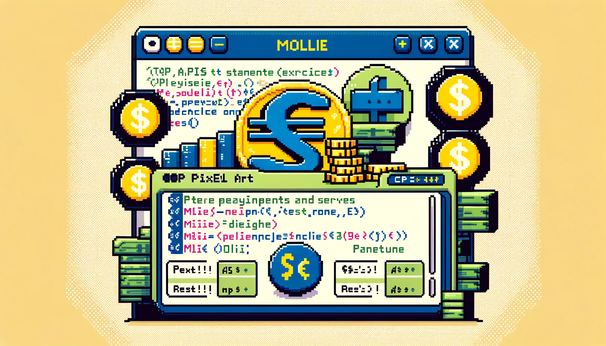

## Introduction aux API

### Définition
Une API (Interface de Programmation d'Application) est un ensemble de règles et de protocoles permettant à une application de communiquer avec une autre application. Une API définit les méthodes et les données que les applications peuvent utiliser pour interagir avec une autre application ou un service.

### Types d'API
- **Web API** : Accessible via le protocole HTTP, souvent appelée web service.
- **Bibliothèque de Fonctions** : Permet d'accéder à des fonctions ou des méthodes dans une bibliothèque logicielle.
- **API Système** : Permet d'interagir avec les fonctionnalités d'un système d'exploitation.

### Avantages des API
- **Interopérabilité** : Permet à des applications développées dans différents langages de programmation de communiquer.
- **Réutilisabilité** : Les services peuvent être utilisés par différentes applications.
- **Extensibilité** : Facile à mettre à jour et à étendre.

<hr>

## Concepts de Base des Web Services

### Définition des Web Services
Un web service est un service disponible sur le web (ou un réseau intranet) qui permet à différentes applications de communiquer entre elles, souvent indépendamment de leurs langages de programmation ou de leurs plateformes.

### Types de Web Services
- **REST (Representational State Transfer)** : Utilise les protocoles HTTP pour échanger des données au format JSON ou XML. Il est léger et facile à utiliser.
- **SOAP (Simple Object Access Protocol)** : Utilise XML pour échanger des informations et peut fonctionner sur plusieurs protocoles comme HTTP, SMTP. Il est plus complexe et plus robuste.

### REST vs SOAP
Comparer les méthodes SOAP et REST pour implémenter des services web peut aider à comprendre leurs forces et faiblesses respectives et à choisir la méthode la plus adaptée à un contexte donné. Voici une comparaison détaillée entre SOAP et REST :

#### 1. Protocole de Communication

##### SOAP
- **Protocole** : SOAP (Simple Object Access Protocol) est un protocole basé sur XML pour l'échange d'informations.
- **Transport** : Peut utiliser différents protocoles de transport comme HTTP, SMTP, etc.
- **Format des messages** : Utilise XML pour formater les messages. Les messages SOAP sont enveloppés dans une enveloppe SOAP.

##### REST
- **Protocole** : REST (Representational State Transfer) n'est pas un protocole mais un style d'architecture qui utilise HTTP.
- **Transport** : Utilise exclusivement HTTP/HTTPS.
- **Format des messages** : Utilise principalement JSON pour la légèreté, mais peut également utiliser XML, HTML, et d'autres formats.

#### 2. Facilité d'Utilisation et Simplicité

##### SOAP
- **Complexité** : Plus complexe à mettre en œuvre en raison de la nécessité de définir des WSDL (Web Services Description Language) pour décrire le service.
- **Structure** : La structure des messages SOAP est plus lourde et plus complexe en raison de l'utilisation d'XML et des en-têtes SOAP.

##### REST
- **Simplicité** : Plus simple et plus facile à utiliser. Il suffit de connaître les verbes HTTP (GET, POST, PUT, DELETE) et les formats de données (souvent JSON).
- **Structure** : Plus léger en termes de structure de message, ce qui rend les interactions plus rapides et plus faciles à déboguer.

#### 3. Flexibilité et Extensibilité

##### SOAP
- **Flexibilité** : Très flexible en termes de transport, car il peut fonctionner sur plusieurs protocoles.
- **Extensibilité** : Extensible grâce aux en-têtes SOAP et aux fonctionnalités de sécurité intégrées comme WS-Security pour les transactions sécurisées.

##### REST
- **Flexibilité** : Fonctionne exclusivement sur HTTP/HTTPS, ce qui peut être une limitation pour certaines applications.
- **Extensibilité** : Moins de fonctionnalités intégrées pour des aspects comme la sécurité et la transaction, mais des solutions comme OAuth peuvent être utilisées pour sécuriser les API REST.

#### 4. Performance

##### SOAP
- **Performance** : Généralement moins performant en raison de l'encombrement supplémentaire lié à l'utilisation d'XML et des en-têtes SOAP. Peut être plus lent à cause de la nécessité de traiter des messages XML volumineux.
- **Overhead** : Les messages SOAP sont souvent plus volumineux en raison de l'encombrement des balises XML.

##### REST
- **Performance** : Plus performant et plus léger grâce à l'utilisation de JSON et à une surcharge minimale. Les appels REST sont souvent plus rapides et nécessitent moins de bande passante.
- **Overhead** : Les messages JSON sont plus légers et plus rapides à analyser que les messages XML.

#### 5. Interopérabilité

##### SOAP
- **Interopérabilité** : Très interopérable et pris en charge par de nombreux langages et plates-formes grâce à la spécification standardisée de SOAP.
- **Support** : Excellente prise en charge pour les transactions complexes et les interactions entreprise-à-entreprise.

##### REST
- **Interopérabilité** : Très interopérable également, surtout avec les services web modernes et les applications mobiles. Utilisé par une large variété d'applications en raison de sa simplicité et de son adoption répandue.
- **Support** : Moins de support pour les transactions complexes et les fonctionnalités avancées par rapport à SOAP, mais suffisant pour la plupart des applications web et mobiles.

#### 6. Cas d'Utilisation Typiques

##### SOAP
- **Cas d'utilisation** : Idéal pour les applications nécessitant des transactions sécurisées, des interactions entreprise-à-entreprise, et des services nécessitant une fiabilité et une sécurité élevées.
- **Exemples** : Services bancaires, services financiers, et autres services nécessitant une sécurité et une conformité strictes.

##### REST
- **Cas d'utilisation** : Idéal pour les applications web et mobiles, les services nécessitant des performances élevées, et les interactions légères.
- **Exemples** : Applications de réseaux sociaux, API publiques pour des services web, intégrations simples entre systèmes.

<hr>

## Création d'un Web Service SOAP en PHP

### Environnement
Nous allons passer à la pratique de la création et de l'utilisation d'un web service SOAP en PHP.
Pour cela nous utiliserons les outils suivants :

- IDE : Visual Studio Code
- Serveur Web : WAMP, MAMP, Laragon etc.
- Extension PHP SOAP : Assurez-vous qu'elle est installée et activée.

### Qu'est-ce que SOAP ?
**SOAP** (Simple Object Access Protocol) est un protocole basé sur XML utilisé pour l'échange d'informations structurées dans l'implémentation de services web. SOAP permet de communiquer entre applications exécutées sur différentes plateformes avec des protocoles de transport comme HTTP et SMTP. Les messages SOAP sont enveloppés dans une enveloppe SOAP qui contient un en-tête et un corps.

### Extension PHP SOAP
PHP offre une extension SOAP qui permet de créer des services SOAP et de consommer des services SOAP existants. Cette extension facilite la manipulation des messages SOAP et l'interaction avec les services web SOAP.

Pour vérifier si l'extension SOAP est installée, vous pouvez exécuter :
```bash
php -m | grep soap
```

Si SOAP n'est pas installé, vous pouvez l'installer via votre gestionnaire de paquets (par exemple, pour Debian/Ubuntu) :
```bash
sudo apt-get install php-soap
```

Assurez-vous que la ligne suivante est présente dans votre fichier php.ini pour activer l'extension SOAP :
```ini
extension=soap
```

### Structure de notre Web Service
Nous allons créer deux fichiers :

- `soap-server.php` : Pour la création du serveur SOAP.
- `soap-client.php` : Pour utiliser le serveur web SOAP.

### Serveur SOAP
Le serveur SOAP expose les méthodes que les clients peuvent appeler. Voici un exemple simple d'un serveur SOAP :

```php
// soap-server.php
<?php

class MySoapServer {
    // Méthode simple qui retourne un message de bienvenue
    public function hello($name) {
        return "Hello, $name!";
    }
}

// Options du serveur SOAP, spécifiant l'URI du service
$options = ['uri' => 'http://localhost:8888/soap-server.php'];

// Crée une nouvelle instance du serveur SOAP
$server = new SoapServer(null, $options);

// Définit la classe contenant les méthodes SOAP
$server->setClass('MySoapServer');

// Gère les requêtes SOAP entrantes
$server->handle();
```

> **Classe `MySoapServer`** : Contient les méthodes que le serveur expose. Ici, nous avons une méthode simple `hello` qui prend un nom en argument et retourne un message de bienvenue.
> 
> **Options du serveur** : Le tableau `$options` spécifie l'URI du service SOAP. Cette URI est utilisée pour identifier l'espace de nom du service.
> 
> **Instance du serveur SOAP** : `SoapServer` est instancié avec `null` pour utiliser un serveur sans WSDL (Web Services Description Language) et les options définies.
> 
> **Définir la classe** : `setClass` lie la classe `MySoapServer` au serveur SOAP.
> 
> **Gérer les requêtes** : `handle` écoute et traite les requêtes SOAP entrantes.

### Utiliser le Web Service SOAP
Le client SOAP permet de consommer les services exposés par le serveur SOAP. Voici un exemple de client SOAP en PHP :

```php
// soap-client.php
<?php

// Options du client SOAP, spécifiant l'URL du serveur SOAP et l'URI
$options = [
    'location' => 'http://localhost:8888/soap-server.php',
    'uri' => 'http://localhost:8888/soap-server.php'
];

// Crée une nouvelle instance du client SOAP
$client = new SoapClient(null, $options);

// Gestion des erreurs et des Exceptions
try {
    // Appel de la méthode hello du serveur SOAP
    $response = $client->hello("World");
    // Affiche "Hello, World!"
    echo $response;
} catch (SoapFault $e) {
    // Affiche le message d'erreur en cas d'exception
    echo "Error: {$e->getMessage()}";
}
```

> **Options du client** : Le tableau `$options` spécifie `location`, l'URL du serveur SOAP, et `uri`, l'espace de nom correspondant.
> 
> **Instance du client SOAP** : `SoapClient` est instancié avec `null` pour se connecter à un serveur sans WSDL et les options définies.
>
> **Appel de méthode** : `hello` appelle la méthode exposée par le serveur SOAP.
>
> **Gestion des exceptions** : `try-catch` est utilisé pour gérer les exceptions et les erreurs potentielles lors de l'appel du service SOAP. En cas d'erreur, un message d'erreur est affiché.

### Conclusion
Nous avons vu comment configurer un serveur et un client SOAP en PHP, comment ajouter des méthodes à exposer via SOAP, et comment gérer les erreurs lors de l'appel des services SOAP. En utilisant ces concepts, vous pouvez créer et consommer des services web SOAP robustes et interopérables en PHP.

<hr>

## Concepts de Base des API REST

Une API REST (Representational State Transfer) utilise les méthodes HTTP pour effectuer des opérations CRUD (Create, Read, Update, Delete) sur les ressources.

### Méthodes HTTP
Les méthodes HTTP en détail :
- **GET** : Récupère des données.
- **POST** : Envoie des données pour créer une nouvelle ressource.
- **PUT** : Met à jour une ressource existante.
- **DELETE** : Supprime une ressource.

### Structure des URI
Les URI (Uniform Resource Identifier) identifient les ressources d'un service. Par exemple :

```bash
/api/users (GET) # Récupère la liste des utilisateurs
/api/users/1 (GET) # Récupère l'utilisateur avec l'ID 1
/api/users (POST) # Crée un nouvel utilisateur
/api/users/1 (PUT) # Met à jour l'utilisateur avec l'ID 1
/api/users/1 (DELETE) # Supprime l'utilisateur avec l'ID 1
```

### Statuts HTTP
Les codes de statut HTTP indiquent le résultat de la requête. Ci-dessous les principales :
- **200** `OK` : La requête a réussi.
- **201** `Created` : Une nouvelle ressource a été créée.
- **400** `Bad Request` : La requête est incorrecte.
- **404** `Not Found` : La ressource n'a pas été trouvée.
- **500** `Internal Server Error` : Erreur interne du serveur.

<hr>

## Création d'une API REST en PHP

### Environnement
Nous allons passer à la pratique, pour cela nous utiliserons les outils suivants :
- IDE : Visual Studio Code
- Serveur Web : WAMP, MAMP, Laragon etc.
- Insomnia

### Structure de notre API
Nous allons créer une api pour tester nos routes et méthodes.
- `public/api.php` : Routeur de l'API.

### Routeur
Le routeur est responsable de recevoir les requêtes HTTP, de les traiter et de renvoyer les réponses appropriées. Voici le code complet du routeur, avec des commentaires détaillés :
```php
<?php
// public/api.php

// Récupère la méthode HTTP (GET, POST, PUT, DELETE)
$method = $_SERVER['REQUEST_METHOD'];

// Récupère le chemin de la requête après /api.php/
$path = isset($_SERVER['PATH_INFO']) ? trim($_SERVER['PATH_INFO'], '/') : '';

// Définit le type de contenu de la réponse comme JSON
header('Content-Type: application/json');

// Route les requêtes en fonction de la méthode HTTP
switch ($method) {
    case 'GET':
        echo json_encode(['Message' => 'GET METHOD']);
        break;

    case 'POST':
        echo json_encode(['Message' => 'POST METHOD']);
        break;

    case 'PUT':
        echo json_encode(['Message' => 'PUT METHOD']);
        break;

    case 'DELETE':
        echo json_encode(['Message' => 'DELETE METHOD']);
        break;

    default:
        http_response_code(405);
        echo json_encode(['error' => 'Method Not Allowed']);
        break;
}
```

Nous testons maintenant notre API avec Insmonia, nous avons les réponses suivantes.
```json
// (GET) => http://localhost:8888/api.php | 200 OK
{
	"Message": "GET METHOD"
}

// (POST) => http://localhost:8888/api.php | 200 OK
{
	"Message": "POST METHOD"
}

// (PUT) => http://localhost:8888/api.php | 200 OK
{
	"Message": "PUT METHOD"
}

// (DELETE) => http://localhost:8888/api.php | 200 OK
{
	"Message": "DELETE METHOD"
}
```

<hr>

## Utilisation d'une API REST en PHP
Pour comprendre comment utiliser une API, nous allons en créer une de to-do list en utilisant PHP et des données JSON.


### Structure de l'API
Nous allons créer une API de to-do list avec les fichiers suivants :
- `public/api.php` : Routeur de l'API.
- `src/TaskController.php` : Contrôleur pour gérer les tâches.
- `data/tasks.json` : Fichier JSON pour stocker les données des tâches.

### Contrôleur
Le contrôleur gère la logique de l'application, notamment la lecture et l'écriture des données des tâches.

```php
// src/TaskController.php
<?php

class TaskController {
    private $filePath;

    // Constructeur pour initialiser le chemin du fichier JSON
    public function __construct($filePath) {
        $this->filePath = $filePath;
    }

    // Lit les tâches depuis le fichier JSON
    private function readTasks() {
        if (!file_exists($this->filePath)) {
            file_put_contents($this->filePath, json_encode([]));
        }
        $json = file_get_contents($this->filePath);
        return json_decode($json, true);
    }

    // Écrit les tâches dans le fichier JSON
    private function writeTasks($tasks) {
        file_put_contents($this->filePath, json_encode($tasks, JSON_PRETTY_PRINT));
    }

    // Récupère toutes les tâches
    public function getTasks() {
        return $this->readTasks();
    }

    // Récupère une tâche par son ID
    public function getTask($id) {
        $tasks = $this->readTasks();
        foreach ($tasks as $task) {
            if ($task['id'] == $id) {
                return $task;
            }
        }
        return null;
    }

    // Crée une nouvelle tâche
    public function createTask($data) {
        $tasks = $this->readTasks();
        $id = count($tasks) ? end($tasks)['id'] + 1 : 1;
        $task = [
            'id' => $id,
            'title' => $data['title'],
            'description' => $data['description'],
            'created_at' => date('Y-m-d H:i:s')
        ];
        $tasks[] = $task;
        $this->writeTasks($tasks);
        return $id;
    }

    // Met à jour une tâche par son ID
    public function updateTask($id, $data) {
        $tasks = $this->readTasks();
        foreach ($tasks as &$task) {
            if ($task['id'] == $id) {
                $task['title'] = $data['title'] ?? $task['title'];
                $task['description'] = $data['description'] ?? $task['description'];
                break;
            }
        }
        $this->writeTasks($tasks);
    }

    // Supprime une tâche par son ID
    public function deleteTask($id) {
        $tasks = $this->readTasks();
        $tasks = array_filter($tasks, function($task) use ($id) {
            return $task['id'] != $id;
        });
        $this->writeTasks($tasks);
    }
}
```

### Fichier de données
Nous créons un fichier vide.
```json
// data/tasks.json
[]
```

### Routeur

Le routeur est responsable de recevoir les requêtes HTTP, de les traiter et de renvoyer les réponses appropriées.

```php
// public/api.php
<?php

require_once '../src/TaskController.php';

// Crée une instance du contrôleur avec le chemin vers le fichier JSON des tâches
$controller = new TaskController('../data/tasks.json');

// Récupère la méthode HTTP (GET, POST, PUT, DELETE)
$method = $_SERVER['REQUEST_METHOD'];

// Récupère le chemin de la requête après /api.php/
$path = isset($_SERVER['PATH_INFO']) ? trim($_SERVER['PATH_INFO'], '/') : '';

// Définit le type de contenu de la réponse comme JSON
header('Content-Type: application/json');

// Route les requêtes en fonction de la méthode HTTP
switch ($method) {
    case 'GET':
        if ($path) {
            // Récupère une tâche spécifique par son ID
            $task = $controller->getTask($path);
            echo json_encode($task);
        } else {
            // Récupère toutes les tâches
            $tasks = $controller->getTasks();
            echo json_encode($tasks);
        }
        break;

    case 'POST':
        // Crée une nouvelle tâche avec les données fournies dans le corps de la requête
        $data = json_decode(file_get_contents('php://input'), true);
        $id = $controller->createTask($data);
        echo json_encode(['id' => $id]);
        break;

    case 'PUT':
        if ($path) {
            // Met à jour une tâche spécifique par son ID avec les nouvelles données fournies
            $data = json_decode(file_get_contents('php://input'), true);
            $controller->updateTask($path, $data);
            echo json_encode(['status' => 'updated']);
        }
        break;

    case 'DELETE':
        if ($path) {
            // Supprime une tâche spécifique par son ID
            $controller->deleteTask($path);
            echo json_encode(['status' => 'deleted']);
        }
        break;

    default:
        // Méthode non autorisée
        http_response_code(405);
        echo json_encode(['error' => 'Method Not Allowed']);
        break;
}
```

:::tip[Aller plus loin]
🚀  Lier l'API à une base de données en utilisant le design pattern MVC.

🚀  Utiliser l'API avec un framework frontend (Vue JS par exemple).
:::

<hr>

## Utilisation d'un service de paiement

Nous allons apprendre apprendre à intégrer un système de paiement en ligne dans une application web en utilisant l'API de Mollie.



### Installer les dépendances

Assurez-vous que Composer est installé sur votre système. Dans votre terminal, naviguez vers votre projet et exécutez:
```bash
composer require mollie/mollie-api-php
```

### Structure du projet

Nous allons créer les fichiers suivants : 

- `index.hmtl` : Ce fichier servira de page de démarrage où les utilisateurs pourront entrer le montant à payer.
- `create-payment.php` : Ce fichier traitera la demande de paiement et redirigera l'utilisateur vers Mollie pour compléter le paiement.
- `thank-you.php` : Cette page sera affichée après que l'utilisateur ait complété le paiement.

```html
// index.html

<!DOCTYPE html>
<html lang="fr">
<head>
    <meta charset="UTF-8">
    <title>Mollie - Démo de paiement</title>
</head>
<body>
    <h1>Mollie - Démo de paiement</h1>
    <form action="create-payment.php" method="post">
        <label for="amount">Montant (EUR):</label>
        <input type="text" id="amount" name="amount" value="10.00" required>
        <button type="submit">Payer</button>
    </form>
</body>
</html>
```

```php
// create-payment.php

<?php
require 'vendor/autoload.php';

use Mollie\Api\MollieApiClient;

try {
    $mollie = new MollieApiClient();
    $mollie->setApiKey("votre_clé_api");

    $payment = $mollie->payments->create([
        "amount" => [
            "currency" => "EUR",
            "value" => $_POST['amount']
        ],
        "description" => "Ma première API de paiement",
        "redirectUrl" => "http://localhost:8888/thank-you.html",
    ]);

    header("Location: " . $payment->getCheckoutUrl(), true, 303);
    exit;
} catch (\Mollie\Api\Exceptions\ApiException $e) {
    echo "Erreur lors de la création du paiement : " . htmlspecialchars($e->getMessage());
}
```

```html
// thank-you.html

<!DOCTYPE html>
<html lang="fr">
<head>
    <meta charset="UTF-8">
    <title>Merci pour votre paiement</title>
</head>
<body>
    <h1>Merci pour votre paiement !</h1>
    <p>Votre paiement a été traité avec succès.</p>
</body>
</html>
```

<hr>

:::tip[Exercice]
## Créer une API d'Authentification

Vous êtes un développeur chargé de créer une API d'authentification pour protéger les accès à une base de données de personnages de la Terre du Milieu. Seuls les utilisateurs autorisés peuvent accéder à certaines ressources protégées. Pour cette tâche, vous utiliserez PHP  en suivant le modèle MVC et une base de données MySQL locale.

> Pour toute tentative d'accès sans authentification réussie, le système doit retourner "Vous ne passerez pas !", en référence à la célèbre phrase de Gandalf.


### Étapes et Scénario de l'Exercice

#### 1. Inscription d'un Utilisateur
Créez un formulaire et une fonctionnalité d'inscription pour ajouter de nouveaux utilisateurs à la base de données. Par exemple, Frodon et Sam veulent accéder à la base de données. Ils doivent s'inscrire avec un nom d'utilisateur et un mot de passe.

- **Tâche :** Implémentez le formulaire d'inscription et la logique associée.
- **Exemple :**
  - Nom d'utilisateur : frodon
  - Mot de passe : monprecieux

#### 2. Connexion d'un Utilisateur
Après l'inscription, Frodon souhaite se connecter pour accéder à la base de données des personnages. Vous devez implémenter une page de connexion qui vérifie les informations d'identification de l'utilisateur.

- **Tâche :** Implémentez le formulaire de connexion et la logique associée.
- **Exemple :**
    - Nom d'utilisateur : frodon
    - Mot de passe : monprecieux

#### 3. Accès Protégé aux Ressources
Frodon souhaite consulter les informations sur Aragorn dans la base de données. Vous devez protéger cette route pour que seules les personnes authentifiées puissent y accéder. Si quelqu'un tente d'accéder à cette route sans être authentifié, le système doit répondre "Vous ne passerez pas !".

- **Tâche :** Implémentez une protection des routes pour vérifier que l'utilisateur est connecté avant d'accéder aux données protégées.
- **Exemple :**
    - Ressource protégée : /characters/aragorn

#### 4. Déconnexion d'un Utilisateur
Frodon a terminé sa session et souhaite se déconnecter. Vous devez implémenter une fonctionnalité de déconnexion pour détruire la session de l'utilisateur.

- **Tâche :** Implémentez la déconnexion.

#### Scénario complet

1. **Inscription :**
Frodon s'inscrit avec le nom d'utilisateur frodon et le mot de passe monprecieux.

2. **Connexion :**
Frodon se connecte avec ses informations d'identification.

1. **Accès Protégé :**
Frodon accède à la route /characters/aragorn et reçoit les informations sur Aragorn.
Un utilisateur non connecté tente d'accéder à la route /characters/aragorn et reçoit le message "Vous ne passerez pas !".

1. **Déconnexion :**
Frodon se déconnecte et sa session est détruite.

:::