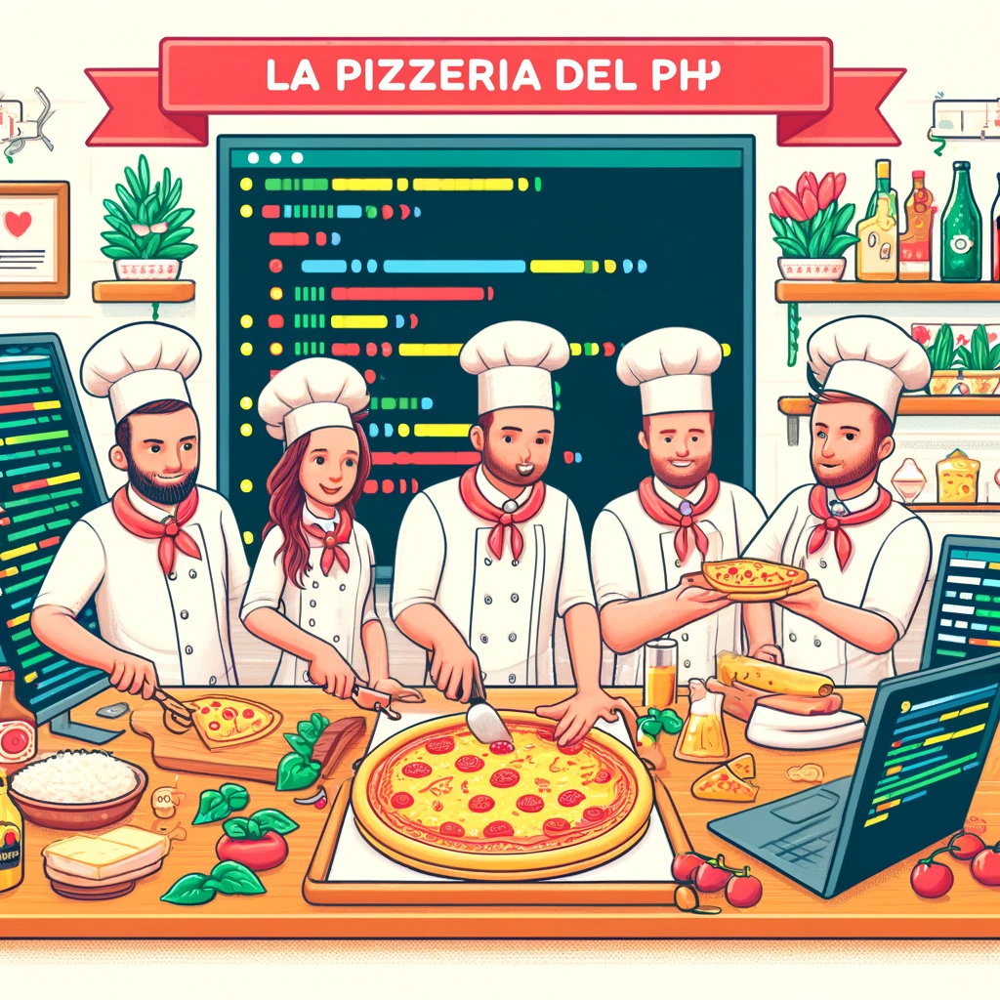

## Introduction

La composition est une approche plus flexible et moins liée de la conception orientée objet. Elle vous permet de créer des objets complexes en combinant des objets plus simples, sans le couplage serré de l'héritage. Cela rend le code plus modulaire et plus facile à maintenir.

## Quand l'utiliser ?

La composition est appropriée lorsque vous pouvez dire d’une relation qu’elle « possède un » / « est composé de » entre deux classes. Par exemple, une classe voiture pourrait avoir un objet moteur comme propriété.

```php title="Exemple"
class Processeur {
    public $marque;
    public $frequence; // En GHz, fréquence du processeur
    
    public function __construct($marque, $frequence) {
        $this->marque = $marque;
        $this->frequence = $frequence;
    }
}

class CarteMere {
    public $marque;
    public $typeSocket; // Type de socket pour la carte mère
    
    public function __construct($marque, $typeSocket) {
        $this->marque = $marque;
        $this->typeSocket = $typeSocket;
    }
}

class DisqueDur {
    public $capacite;  // En GB, capacité de stockage du disque dur
    public $type; // Type du disque dur (SSD ou HDD)
    
    public function __construct($capacite, $type) {
        $this->capacite = $capacite;
        $this->type = $type;
    }
}

class MemoireRAM {
    public $capacite; // En GB, capacité de la mémoire RAM
    public $frequence; // En MHz, fréquence de la mémoire RAM
    
    public function __construct($capacite, $frequence) {
        $this->capacite = $capacite;
        $this->frequence = $frequence;
    }
}

class Ordinateur {
    public $processeur;
    public $carteMere;
    public $disqueDur;
    public $memoireRAM;
    
    public function __construct($processeur, $carteMere, $disqueDur, $memoireRAM) {
        $this->processeur = $processeur;
        $this->carteMere = $carteMere;
        $this->disqueDur = $disqueDur;
        $this->memoireRAM = $memoireRAM;
    }
}

// Création d'un ordinateur
$monProcesseur = new Processeur('Intel', 3.6);
$maCarteMere = new CarteMere('ASUS', 'AM4');
$monDisqueDur = new DisqueDur(500, 'SSD');
$maMemoireRAM = new MemoireRAM(16, 2400);

$monOrdinateur = new Ordinateur($monProcesseur, $maCarteMere, $monDisqueDur, $maMemoireRAM);
```

Dans cet exemple, la classe `Ordinateur` utilise la composition pour inclure des instances de `Processeur`, `CarteMere`, `DisqueDur` et `MemoireRAM`. Chaque composant peut être modifié ou remplacé sans affecter la structure globale de la classe `Ordinateur`, ce qui montre la flexibilité de la composition par rapport à l'héritage.

## Avantages de la composition

La composition comporte un certain nombre d’avantages sur l’héritage, notamment :

### Plus de flexibilité

La composition vous permet de créer des objets complexes en combinant des objets plus simples, sans le couplage serré de l’héritage. Cela rend le code plus modulaire et plus facile à maintenir.

```php title="Modification des composants d'un ordinateur"
// Modification du processeur sans affecter d'autres composants
$monOrdinateur->processeur = new Processeur('AMD', 4.0);

// Ajout facile d'un second disque dur
$secondDisqueDur = new DisqueDur(1000, 'HDD');
$monOrdinateur->disqueDurSecondaire = $secondDisqueDur;
```

_Ce code montre comment on peut facilement modifier ou ajouter des composants à l'instance de la classe `Ordinateur` sans redéfinir ou modifier les autres parties de la classe. Cela démontre la flexibilité offerte par la composition, où des changements peuvent être effectuées de manière modulaire._

### Moins de duplication de code

La composition peut aider à réduire la duplication de code en vous permettant de réutiliser les mêmes objets de différentes manières.

```php title="Réutilisation des composants dans différentes classes"
class Serveur {
    public $processeur;
    public $disqueDur;
    public $memoireRAM;
    
    public function __construct($processeur, $disqueDur, $memoireRAM) {
        $this->processeur = $processeur;
        $this->disqueDur = $disqueDur;
        $this->memoireRAM = $memoireRAM;
    }
}

// Réutilisation des mêmes classes de composants pour un autre type d'objet
$serveur = new Serveur($monProcesseur, $monDisqueDur, $maMemoireRAM);
```

_Les mêmes classes de composants (`Processeur`, `DisqueDur`, `MemoireRAM`) sont utilisées pour créer un autre type d'objet complexe, `Serveur`. Cette approche évite de redéfinir les mêmes propriétés et méthodes dans différentes classes, réduisant ainsi la duplication du code._

### Plus facile à tester

La composition peut rendre le code plus facile à tester car elle vous permet d’isoler des objets individuels et de les tester indépendamment.

```php title="Test unitaire pour la classe Processeur"
function testProcesseur() {
    $processeurTest = new Processeur('TestBrand', 2.5);
    assert($processeurTest->frequence === 2.5, "La fréquence doit être de 2.5 GHz);
    assert($processeurTest->marque === "Intel", "La marque doit être 'Intel'");
}
testProcesseur();
```

_Cet exemple montre comment tester individuellement la classe `Processeur` sans dépendre d'autres classes ou du contexte plus large de la classe `Ordinateur`. Chaque composant peut être testé de manière isolée, ce qui facilite grandement le débogage._ 

## Conclusion

L’héritage et la composition sont deux outils puissants pour la conception orientée objet. Cependant, la composition est généralement considérée comme une approche plus souple et faiblement couplée, ce qui en fait un bon choix pour la plupart des situations.


:::tip[Exercice]
## La Pizzeria Del PHP



Votre mission, si vous l'acceptez, nourrir les plus célèbres tortues masquées Michelangelo, Leonardo, Raphael et Donatello. Vous devrez développer un système de gestion de pizzeria en PHP en utilisant le concept de composition pour manipuler divers ingrédients et créer différentes recettes de pizzas.

### Objectif de l'exercice

Vous êtes chargé de développer une application pour une pizzeria qui souhaite informatiser la gestion de ses recettes de pizzas. Chaque pizza est composée de divers ingrédients et chaque ingrédient a un coût associé. Le système doit permettre de créer des pizzas personnalisées en combinant différents ingrédients et calculer le coût total de la pizza.

### Consignes

#### 1. Définir les classes :
- Ingrédient : Créez une classe pour représenter un ingrédient. Chaque ingrédient possède un nom et un prix.
- Pizza : Créez une classe pour représenter une pizza. Une pizza est composée de plusieurs ingrédients. Elle devra pouvoir : ajouter un ingrédient et calculer le prix total en fonction des ingrédients utilisés.

#### 2. Implémentation :
- Instanciez plusieurs ingrédients (par exemple : tomate, fromage, champignons, pepperoni).
- Créez différentes pizzas en ajoutant des ingrédients choisis.
- Afficher le nom de chaque pizza, ses ingrédients et le coût total.

#### 3. Affichage :
- Pour chaque pizza créée, générer une sortie qui liste son nom, les ingrédients ajoutés, et le prix total.

```shell title="Exemple d'affichage attendu"
Nom de la Pizza: Pizza Pepperoni
Ingrédients: Pâte, Sauce Tomate, Fromage, Pepperoni
Prix Total: 8.50€

Nom de la Pizza: Pizza Végétarienne
Ingrédients: Pâte, Sauce Tomate, Fromage, Olives, Champignons, Poivrons
Prix Total: 9.75€
```

💡 Utilisez des méthodes appropriées pour ajouter des ingrédients et calculer le prix. <br>
💡 Assurez-vous que le code est bien organisé et commenté pour faciliter la compréhension et la maintenance. <br>
💡 Vous pouvez ajouter des fonctionnalités comme la suppression d'ingrédients ou la modification de recettes existantes. <br>
:::

:::tip[Exercice]
## WarClass


Dans le royaume imaginaire de PhpVille, les anciens héros légendaires ont été invoqués par magie après des siècles de paix pour se battre dans une arène mythique. Chaque héros possède des compétences uniques et des pouvoirs ancestraux. Les joueurs choisiront leur héros et formeront des alliances pour conquérir l'arène. Cependant, chaque héros doit apprendre à utiliser non seulement ses propres pouvoirs mais aussi à tirer parti des forces de ses alliés pour vaincre ses adversaires dans des combats stratégiques.

### Objectif de l'exercice
- Utilisation de la programmation orientée objet en PHP : vous devrez utiliser des classes pour représenter les différents héros, leurs compétences et les éléments du jeu.
- Comprendre et appliquer l'héritage : Les types de héros peuvent hériter de classes parentes communes.
- Utiliser la composition : Implémenter des objets qui utilisent d'autres objets (par exemple, un héros peut avoir un objet "Arme" ou "Armure").

### Consignes

1. Création des Classes de Base :
   - Classe Hero : Doit avoir des attributs comme `nom`, `niveau`, `pointsDeVie`, et `pointsDeForce`. Inclure des méthodes pour `attaquer` et `défendre`.
   - Classe Arme : Avec des attributs tels que `nom` et `puissance`. Ajouter une méthode pour `utiliser`.
2. Héritage :
   - Classes dérivées de `Hero` comme `Guerrier`, `Sorcier`, et `Archer`, chacune avec des compétences spécifiques (par exemple, `Guerrier pourrait avoir une méthode `frapperFort`).
3. Composition :
   - Intégrer des objets `Arme` dans les objets `Hero` pour augmenter leur puissance d'attaque.
   - Créer une classe `Armure` qui pourrait être utilisée pour défendre contre des attaques.
4. Mécaniques du Jeu :
   - Développer un système de combat simple où les héros peuvent s'affronter. Prendre en compte les attributs comme les points de vie et la puissance des armes.
5. Interface utilisateur
   - Afficher des informations basiques sur l'écran, comme la santé du héros, l'arme équipée, et le héros actuellement en combat.
   - Offrir des options simples à l'utilisateur pour attaquer ou se défendre.

```php title="Exemple de code pour visualiser les combats"
<!DOCTYPE html>
<html lang="fr">
<head>
    <meta charset="UTF-8">
    <title>Jeu de Combat Simple</title>
    <style>
        body {
            display: flex;
            justify-content: space-around;
            align-items: center;
            height: 100vh;
        }

        .avatar img {
            width: 100px
        }

        .health-bar {
            height: 10px;
            background-color: red;
            margin-top: 5px;
        }
    </style>
</head>
<body>
<?php
// PHP pourrait être utilisé ici pour initialiser des variables de jeu
?>
<div class="avatar" id="player1">
    
    <div class="health-bar" id="health1" style="width: 100%;"></div>
</div>
<div class="avatar" id="player2">
    
    <div class="health-bar" id="health2" style="width: 100%;"></div>
</div>
<button onclick="attack('player1')">Attaquer Joueur 1</button>
<button onclick="attack('player2')">Attaquer Joueur 2</button>
<script>
    function attack(playerId) {
        const healthBar = document.getElementById(playerId === 'player1' ? 'health2' : 'health1');
        const currentWidth = parseInt(healthBar.style.width);
        const newWidth = Math.max(0, currentWidth - 20); // Réduire la vie de 20%
        healthBar.style.width = newWidth + '%';

        // Vérifier si le joueur est "mort"
        if (newWidth <= 0) {
            alert('Le joueur ' + (playerId === 'player1' ? '2' : '1') + ' a perdu!');
        }
    }
</script>
</body>
</html>
```
:::