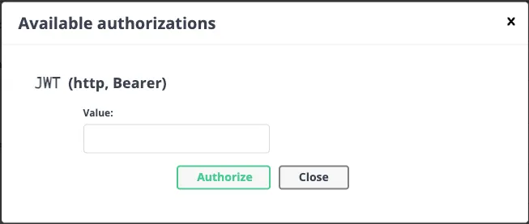
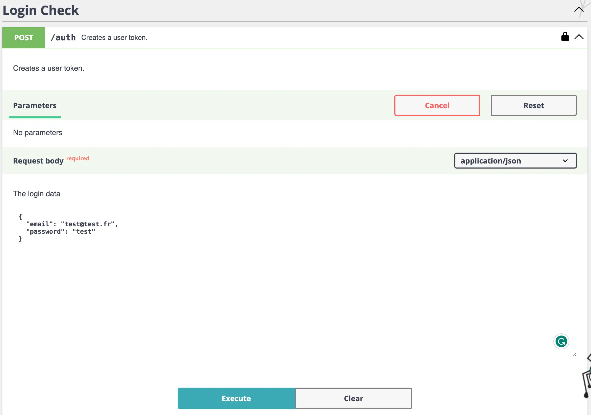
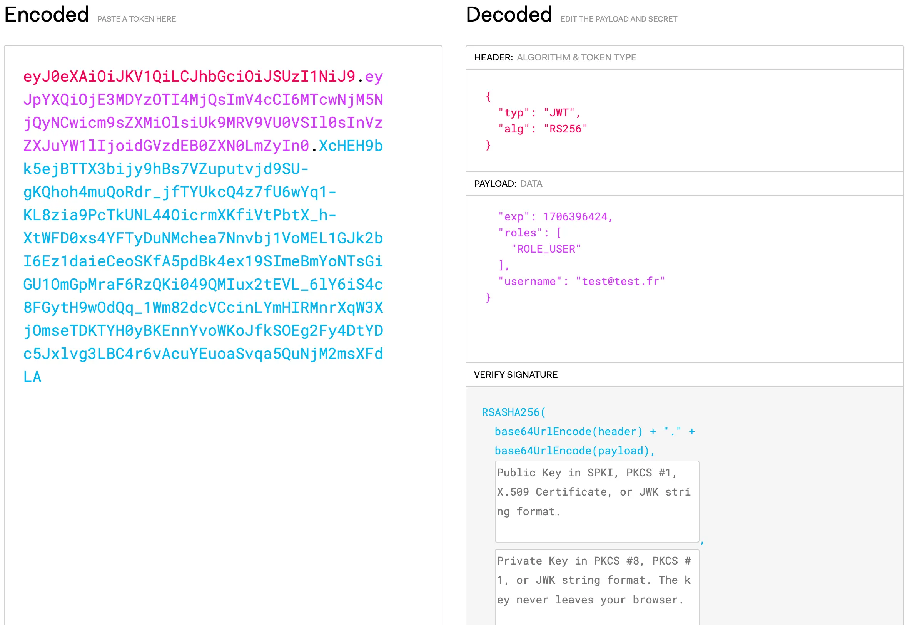

:::note[Documentation]
📓 [API-platform](https://api-platform.com/docs/core/jwt/) <br>
📓 [Symfony](https://symfony.com/doc/current/security.html#json-login) <br>
📦 [Bundle](https://symfony.com/bundles/LexikJWTAuthenticationBundle/current/index.html#prerequisites) <br>
📓 [JSON Web Tokens](https://jwt.io/) <br>
📓 [Github](https://github.com/lexik/LexikJWTAuthenticationBundle?tab=readme-ov-file)
:::

## Installation du bundle
Pour installer le bundle, nous allons utiliser `composer`.
```bash title="Installation avec composer"
composer require lexik/jwt-authentication-bundle
```

## Génération d'une paire de clés
Pour générer une paire de clés, nous utiliserons la commande du bundle. Cette commande crée 2 clés (privée et publique) dans le répertoire `config/jwt/`, `private.pem` et `public.pem`.
```bash title="Générer une paire de clés"
php bin/console lexik:jwt:generate-keypair
```

## Mise à jour du fichier security.yaml
Nous devons modifier le fichier `security.yaml`, nous pourrons l'ajuster en fonction de nos besoins.
```yml
// config/packages/security.yaml
# ...

providers:
    # used to reload user from session & other features (e.g. switch_user)
    app_user_provider:  
        entity:
            class: App\Entity\User
            property: email
    
    jwt:
      lexik_jwt:
      class: App\Entity\User
  
# ...

firewalls:
    dev:
        pattern: ^/(_(profiler|wdt)|css|images|js)/
        security: false

    login:
        pattern: ^/api/login$
        stateless: true
        provider: app_user_provider
        json_login:
            check_path: /api/login
            username_path: email
            success_handler: lexik_jwt_authentication.handler.authentication_success
            failure_handler: lexik_jwt_authentication.handler.authentication_failure

    api:
        pattern: ^/api
        stateless: true
        provider: jwt
        entry_point: jwt
        jwt: ~

  # ...

    access_control:
        - { path: ^/$, roles: PUBLIC_ACCESS } # Allows accessing the Swagger UI
        - { path: ^/docs, roles: PUBLIC_ACCESS } # Allows accessing the Swagger UI docs
        - { path: ^/api/login$, roles: PUBLIC_ACCESS } 
        - { path: ^/api, roles: IS_AUTHENTICATED_FULLY }

# ...
```

## Configuration API Platform
Nous allons configurer API Platform grace au fichier `api_platform.yaml`.
```yml
// config/packages/api_platform.yaml
api_platform:
    swagger:
         api_keys:
             JWT:
                name: Authorization
                type: header
```

## Ajout des informations nécessaires pour l'authentification
Nous ajoutons un point de terminaison à SwaggerUI pour récupérer un jeton JWT LexikJWTAuthenticationBundle pour un intégration avec API Platform, cela ajoutera un point terminaison OpenAPI pour récupérer le jeton dans l'interface utilisateur Swagger.
```yml
// config/packages/lexik_jwt_authentication.yaml
lexik_jwt_authentication:
    secret_key: '%env(resolve:JWT_SECRET_KEY)%'
    public_key: '%env(resolve:JWT_PUBLIC_KEY)%'
    pass_phrase: '%env(JWT_PASSPHRASE)%'
    token_ttl: 3600
```

## Modification des routes
Ajout de la route pour le login de l'utilisateur, dans `config/routes.yaml`.
```yml
// config/routes.yaml
api_login_check:
    path: /api/login
```

## Tester l'authentification
Saisir `bearer` suivi de la `clé publique`


S'authentifier avec l'identifiant (email) et le mot de passe.


Token de réponse


Détail des informations dans le token


## Modification du JWT à la création
Nous pouvons modifier le contenu de notre JWT en utilisant un Subscriber associé à un événement, voir la [documentation](https://github.com/lexik/LexikJWTAuthenticationBundle/blob/3.x/Resources/doc/2-data-customization.rst#adding-custom-data-or-headers-to-the-jwt), il va écouter l'événement `exik_jwt_authentication.on_jwt_created`.

### Créer le EventSubscriber
Nous pouvons directement créer le Subscriber avec la commande ci-dessous, il nous faudra y renseigner l'événement.
```bash title="Commande pour créer un Subscriber"
php bin/console make:subscriber <Subscriber-name>
```

### Éditer le Subscriber
Voici un exmple de Subscriber pour éditer les informations à renseigner dans le JWT, nous avons plusieurs méthodes disponibles. <br>
- getUser() ➡️ Nous permet de récupérer les informations de l'utilisateur. <br>
- getData() ➡️ Nous permet de récupérer les informations dans le token JWT. <br>
- getHeader() ➡️ Nous permet de récupérer les informations dans le header du token JWT.
```php
// src/EventSubscriber/JWTSubscriber.php
<?php

namespace App\EventSubscriber;

use App\Entity\User;
use Lexik\Bundle\JWTAuthenticationBundle\Event\JWTCreatedEvent;
use Symfony\Component\EventDispatcher\EventSubscriberInterface;

class JWTSubscriber implements EventSubscriberInterface
{
    public function onLexikJwtAuthenticationOnJwtCreated(JWTCreatedEvent $event): void
    {
        /**
         * Add information in the Token
         *
         * getUser();
         * getData();
         * getHeader();
         */
         
         // Exemple de code pour modifier le token JWT       
         
        $data = $event->getData();
        $user = $event->getuser();
        if ($user instanceof User) {
            $data['username'] = $user->getId();
        }
        $event->setData($data);
    }

    public static function getSubscribedEvents(): array
    {
        return [
            'lexik_jwt_authentication.on_jwt_created' => 'onLexikJwtAuthenticationOnJwtCreated',
        ];
    }
}

```